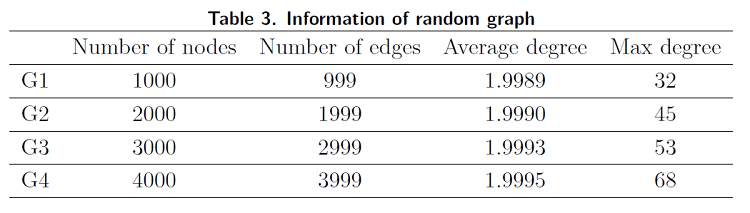
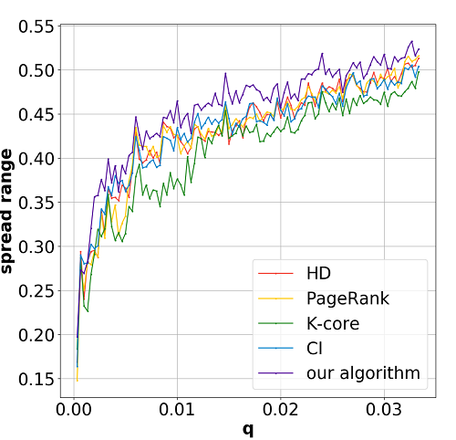

# EE447 Course Project

## Introduction
Social network -- modeled as a graph of relationships and interactions within a group of individuals -- plays a fundamental role as a medium for the spread of information, ideas, and influence among ites members. One of the primary phenomena that is extensively studied in social networks is the spread of contagion, where infection starts from one or multiple sources and spread to a larger scope of vertexes.

A motivating application for the study of influence spread is active propagation of valuable information, often seen in cases of viral marketing strategies, in which a fraction of customers are provided with free copies of a product, and the retailer desires the number of adoptions triggered by such trials to be maximized.

Our work is mainly inspired by the framework on the optimal percolation. In our work, we are going to study the complementary problem of finding the minimal set of nodes to infect as many other nodes as possible.

## Experiment
We conduct 4 different random graph as network on which we can test the performance of our algorithm. The basic information of these 4 networks are shown in the table:

One of the result is shown as follows:

From the result we can see that in a small fraction of seed nodes, our algorithm performs much better than baseline algorithms like k-core. It also achieve higher spread range than the CI method, which doesn't consider the probability of successful transimission on the edge. In our simulation experiment, HD and PageRank have a similar performance but a little bit worse than our algorithm.

